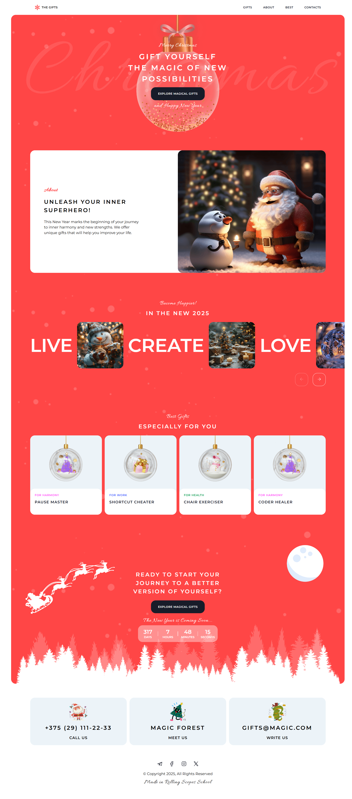
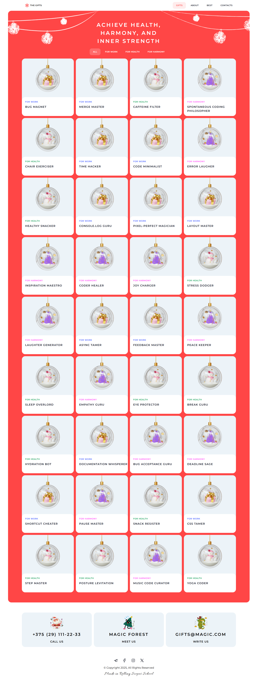
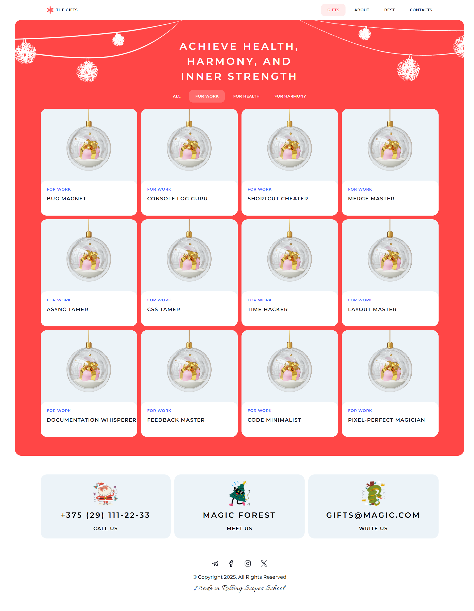
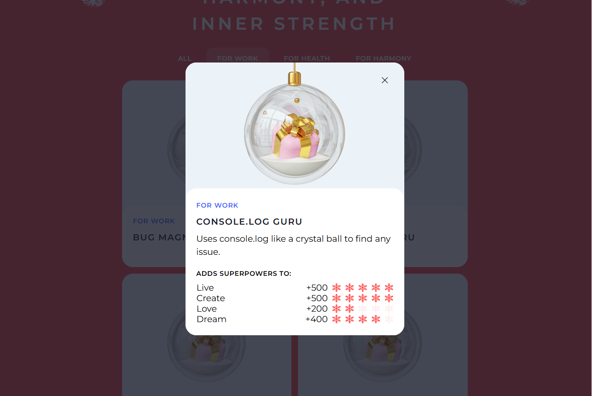

# Сhristmas Shop

An interactive web project featuring a Christmas gift catalog with category filtering and a detailed modal view.
The project is built using Vanilla JavaScript (ES Modules) without any frameworks.

---

## Screenshot

<table>
  <tr>
    <td></td>
    <td></td>
  </tr>
  <tr>
    <td></td>
    <td></td>
  </tr>
</table>

---

🔗 Live Demo: https://tatiana-golub.github.io/christmas-shop/index.html

---

## ✨ Features

- Gift cards rendering
- Category-based filtering
- Modal window with detailed gift information
- Visual representation of gift “powers”
- Random best gifts section
- Countdown timer to New Year
- Slider component
- Responsive layout
- Burger menu for mobile devices
- Scroll-to-top button

---

## Technologies Used

- HTML5
- CSS3 (BEM methodology)
- JavaScript (ES6+)
- Native `<dialog>` API

---

## Architecture

The project follows modular architecture:

```
components/
  ├── gifts/
  │     ├── giftCard.js
  │     ├── giftModal.js
  │     ├── giftsFilter.js
  │     └── giftsRandom.js
  ├── slider.js
  ├── timer.js
  ├── burgerMenu.js
  └── scrollTop.js

utils/
  ├── getCategoryClass.js
  ├── getGiftImage.js
  └── loadGifts.js
```
---

## Installation & Setup

```bash
git clone https://github.com/Tatiana-Golub/christmas-shop.git
cd christmas-shop
```
Run the project using Live Server or any local development server.

---

## Project Goals

- Practice modular architecture
- Improve DOM manipulation skills
- Build UI without frameworks
- Strengthen JavaScript fundamentals


